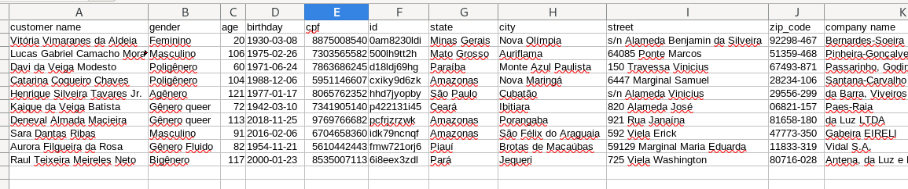

## Random Data Generator

A script using [Faker](https://github.com/faker-ruby/faker) and [Factory Bot](https://github.com/thoughtbot/factory_bot) to generate random data in `csv` file format.

### Example


### Requirements
It is necessary [Ruby](https://www.ruby-lang.org/en/)

### Setup
Clone this repository and execute the command below to install the necessary Gems:
```
bundle install
```

### Usage
The classes `Customer`, `Company` and `Address` defined in the script specified the information present in the output file. These are example and could be modified or expanded.

The methods `header_build` and `content_build` specified the structure the output file. Don't forget to match the header and content values. Explore the [Generators](https://github.com/faker-ruby/faker#generators) to see more possibilities of data types.

The variable `lines_count` define how many lines the output file will have.

The variable global `$separator` define the delimiter character.

### Run
Execute the command below to generate the output file:
```
ruby ./script.rb
```
